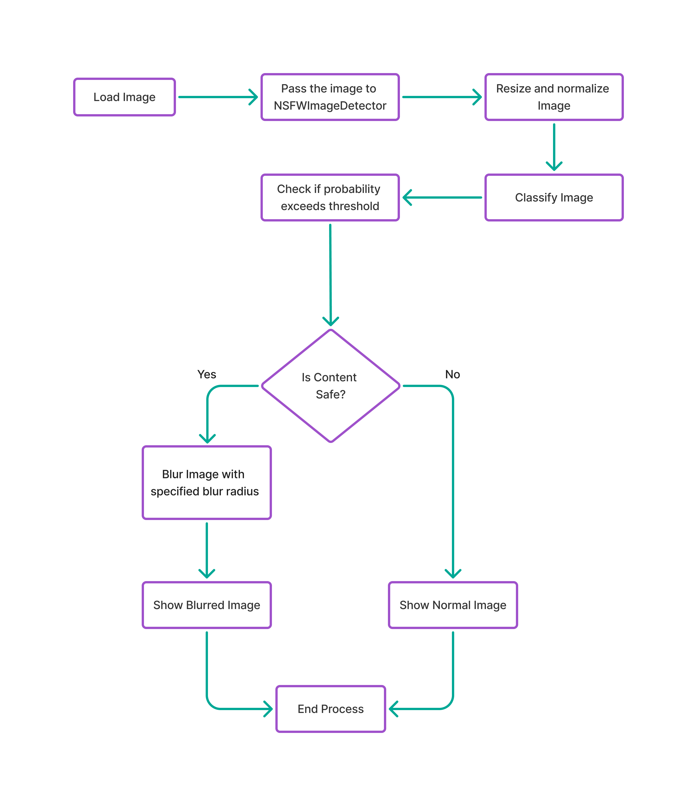

# Safe Image


<p align="center">
  
</p>


## 📖 Description  
**Safe Image** is an AI-powered image filtering library designed to promote safe and culturally appropriate content.  
The library uses advanced deep learning models to automatically detect and blur inappropriate or sensitive content in images, with full control over the blur strength, ensuring that visuals remain respectful and aligned with Islamic values.  

<p align="center">
  
</p>

## 🚀 How to Use  

### Installation  

1. Make sure **Maven Central** is added to your project-level `build.gradle` (or `settings.gradle` for Gradle 7+):  

```gradle
repositories {
    google()
    mavenCentral()
}
```

2. Add **Safe Image** in module-level `build.gradle`:  

```
dependencies {
    implementation("com.example:safe-image:1.0.0")
}
```
---

### 1. Jetpack Compose Usage  

#### Minimal Usage  

If you only want to display an image with automatic safe blurring, you can use **SafelImage** with just the `model` parameter:  

```kotlin
SafeImage(
    model = "https://example.com/sample.jpg",
    contentDescription = "Sample Image"
)
```

#### Customizable Usage  

You can fully customize **SafeImage** by providing parameters such as `loadingContent`, `errorContent`, `onBlurContent`, `blurRadius`, and more:  

```kotlin
SafeImage(
    modifier = Modifier.fillMaxWidth(),
    model = "https://example.com/sample.jpg",
    contentDescription = "Sample Image",
    loadingContent = { Text(text = "Loading...") },
    errorContent = { Text(text = "Error loading image") },
    onBlurContent = { Text(text = "Sensitive content")},
    blurRadius = 20.dp,
    contentScale = ContentScale.FillWidth
)
```
#### Parameters Reference  


| Parameter          | Type                | Default | Description |
|--------------------|---------------------|---------|-------------|
| `model`            | `Any`               | —       | The image source (URL, file, resource, etc.) |
| `contentDescription` | `String?`         | `null`  | Description for accessibility (screen readers) |
| `modifier`         | `Modifier`          | `Modifier` | Layout styling (size, padding, etc.) |
| `loadingContent`   | `@Composable () -> Unit` | `null` | UI to display while the image is loading |
| `errorContent`     | `@Composable () -> Unit` | `null` | UI to display if loading fails |
| `onBlurContent`    | `@Composable () -> Unit` | `null` | UI overlay shown when inappropriate content is blurred |
| `blurRadius`       | `Dp`                | `16.dp` | Blur strength applied to blurred images |
| `contentScale`     | `ContentScale`      | `ContentScale.Crop` | Defines how the image should scale inside its container |

---


### 2. XML Usage

#### Minimal Usage  

If you only want to display an image with automatic safe blurring, you can use **SafeImage** with just the `model` parameter:  

```kotlin
val imageView = findViewById<ImageView>(R.id.imageView1)
imageView.loadSafeImage(
    model = "https://example.com/sample.jpg",
    placeholderRes = R.drawable.loading_bar,
    errorDrawableRes = R.drawable.error_svgrepo_com
)
```

#### Customizable Usage  

You can fully customize **SafeImage** by providing parameters such as `onLoading`, `onError`,  `blurRadiusPx`, and more:  

```kotlin
val imageView = findViewById<ImageView>(R.id.imageView1)
imageView.loadSafeImage(
    model = "https://example.com/sample.jpg",
    blurRadius = 70,
    onLoading = { 
        Toast.makeText(context, "Loading image...", Toast.LENGTH_SHORT).show() 
    },
    onError = { 
        Toast.makeText(context, "Failed to load image", Toast.LENGTH_SHORT).show() 
    },
    onSuccess = { 
        Toast.makeText(context, "Image loaded successfully!", Toast.LENGTH_SHORT).show() 
    },
    crossFadeEnabled = true,
    placeholderRes = R.drawable.loading_bar,
    errorDrawableRes = R.drawable.error_svgrepo_com
)
```
#### Parameters Reference  


| Parameter          | Type                   | Default | Description |
|--------------------|------------------------|---------|-------------|
| `model`           | `Any`                  | —       | The image source (URL, file, resource, etc.) |
| `blurRadius`       | `Int`                  | `50`    | Blur intensity in **pixels** |
| `onLoading`        | `(() -> Unit)?`        | `null`  | Callback triggered when image starts loading |
| `onError`          | `(() -> Unit)?`        | `null`  | Callback triggered if image loading fails |
| `onSuccess`        | `(() -> Unit)?`        | `null`  | Callback triggered when image loads successfully |
| `crossFadeEnabled` | `Boolean`              | `true`  | Enables smooth crossfade animation between placeholder and image |
| `placeholderRes`   | `@DrawableRes Int?`    | `null`  | Drawable resource displayed while loading |
| `errorDrawableRes` | `@DrawableRes Int?`    | `null`  | Drawable resource displayed on error |

----

## 🛠️ How Does It Work?  

Safe Image integrates seamlessly with Coil’s image loading pipeline, working specifically on the **Transformation step** to detect and blur unsafe images before they are displayed.  
This ensures maximum performance and that sensitive content never flashes on the screen unblurred.


<p align="center">
  
</p>


When you load an image with **Safe Image**, it is first passed through Coil’s request pipeline, which includes a custom transformation. This transformation uses an AI-powered detector to analyze the image before it is displayed. If the detector identifies unsafe content, the image is blurred with a configurable blur radius; otherwise, it is shown normally.  

Under the hood, the detection is powered by a TensorFlow Lite model trained to distinguish between safe and unsafe content. Each image is resized, normalized, and classified, and if the probability of sensitive content exceeds a threshold, the image is flagged as haram.  

To ensure smooth performance, Coil’s memory and disk caching are enabled so images are not repeatedly processed.
<p align="center">
  
</p>

----

## 📊 Model & Dataset   

- The AI model was trained on a custom dataset consisting of **11,304 images**, categorized as either **safe** or **unsafe**.  
- The **unsafe category** includes **5,652 images** containing sensitive or explicit content.  
- The **safe category** also contains **5,652 images**, featuring appropriate content such as individuals in everyday attire, including hijabi women, men, and women in normal contexts.  
- To improve generalization and accuracy, the dataset was carefully collected from individuals of **diverse nationalities**.  
- The trained model achieved an accuracy of **96% on the training set** and **94% on the testing set**, effectively covering the majority of sensitive content detection cases, with only a few exceptions.  
- The deployed **TFLite model size** is **~10 MB**.  
- Supported image formats: **PNG**, **JPG**, **JPEG2000**, and **WEBP**.

----

## 🌍 Supported Platforms  

Safe Image is built as a **Kotlin Multiplatform (KMP)** project.  
Below are the currently supported targets:  

| Platform | Status | Notes                                    |
|----------|--------|------------------------------------------|
| **Android (Compose)** | ✅ Implemented | Full support with `SafeImage` composable |
| **Android (XML Views)** | ✅ Implemented | `loadSafeImage` extension for ImageView  |
| **iOS** | ⏳ Not yet implemented | Planned for future release               |
| **Desktop** | ⏳ Not yet implemented | Planned for future release               |
| **Web** | ⏳ Not yet implemented | Planned for future release               |
----
## 🔮 Future Plans  

We are continuously improving **Safe Image**. Here are some of the planned features and enhancements:  

- **Extended Platform Support** – bringing Safe Image to iOS, Desktop, and Web through Kotlin Multiplatform.  
- **Smarter AI Model** – improved accuracy with larger and more diverse training datasets.  

🙌 Contributions and suggestions are always welcome!  

----

## 🤝 Contributors  

Safe Image is proudly developed and maintained by:  

- [**Abdulrahman Khattab**](https://github.com/Abdulrahman-Khattab)  
- [**Fares Mohamed**](https://github.com/FaresM0hamed)  
- [**Malak Raef**](https://github.com/Malak187)  
- [**Muhammed Edrees**](https://github.com/MuhammedEdrees)  


----

## 📄 License  

Safe Image is released under the **MIT License**.  

You are free to use, modify, and distribute this library in your projects, provided that proper credit is given.  

See the [LICENSE](LICENSE) file for full details.  


